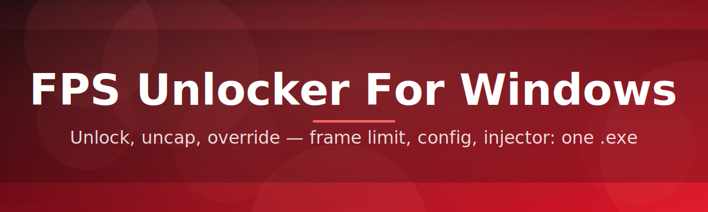

# fps-booster-utility 🚀⚡

  

*Unlock every frame your GPU already worked hard to render — smoother Windows gaming, one tweak at a time.*

  

## 🎯 Overview

`fps-booster-utility` is a lightweight FPS unlocker for Windows built for players who feel like their hardware is being held back by invisible frame ceilings. Instead of guessing which setting is throttling your gameplay, this tool inspects your system's rendering pipeline, background load, and power profile, then applies sensible adjustments so your frame rate reflects what your machine can actually deliver. It's the difference between *"why does this feel sluggish"* and *"oh, that's why it feels smooth now."*

The project exists because most FPS-related advice online is scattered across forum threads, outdated wikis, and conflicting registry tweaks. We consolidated the reliable, safe techniques into a single standalone Windows FPS booster with a clean interface — no fifteen browser tabs required. Whether you're running competitive shooters at high refresh rates or just want your desktop to feel snappier, this utility gives you visibility and control over the variables that matter.

This is built for everyday PC gamers, streamers optimizing for stable output, laptop users fighting thermal throttling, and tinkerers who like understanding *why* a fix works instead of blindly copying a settings screenshot. No background telemetry, no bloat — just a focused Windows performance unlocker that respects your time and your rig.

---

## 🔥 What Makes It Tick

| Capability | Why It Matters |
|---|---|
| **Frame Ceiling Removal** | Detects artificial caps imposed by power plans, background services, or stale drivers and clears the path for higher sustained FPS. |
| **Adaptive Priority Engine** | Dynamically reassigns CPU scheduling priority to your active game process without needing manual Task Manager surgery every session. |
| **Latency-Aware Tuning** | Balances raw frame rate against input latency so "more FPS" never quietly means "more delay." |
| **One-Click Profiles** | Save a tuning profile per game — competitive titles get aggressive settings, casual titles get battery-friendly ones. |
| **Background Noise Filter** | Identifies resource-hungry startup processes and telemetry services eating frame budget you never agreed to give up. |
| **Live Overlay Readout** | A minimal on-screen FPS, frame time, and GPU load readout so you can see the impact of every change in real time. |
| **Zero-Footprint Design** | Runs as a single standalone executable — nothing installed into system folders, nothing left behind when you're done. |
| **Rollback Safety Net** | Every change is reversible with one click, so experimenting with Windows performance settings never feels risky. |

> [!TIP]
> Start with the **Balanced** profile before jumping to **Aggressive**. Most of the visible FPS gain comes from the first pass — the rest is fine-tuning.

---

## 🧭 Getting Started, the Friendly Way

Let's walk through it together — this really takes less than five minutes.

1. **Visit the landing page** using the download button above (or below) to grab the current build.
2. **Save the executable** somewhere memorable, like your Desktop or a dedicated `Tools` folder.
3. **Run it** — Windows SmartScreen may ask for confirmation on first launch since it's a smaller independent project; that's expected.
4. **Pick a profile**, hit **Apply**, and launch your game. Watch the overlay to see your new frame rate in action.

> [!NOTE]
> First launch performs a quick system scan (driver version, power plan, background load). This takes a few seconds and only runs locally on your machine.

---

## 🖥️ System Requirements

| OS | RAM | Disk |
|---|---|---|
| Windows 10 (64-bit, build 19041+) | 4 GB minimum, 8 GB recommended | 150 MB free space |
| Windows 11 (all current builds) | 4 GB minimum, 8 GB recommended | 150 MB free space |

> [!IMPORTANT]
> This is a standalone Windows FPS unlocker — there are no external dependencies, runtimes, or frameworks to install beforehand. Download it, run it, done.

  

---

## ⚙️ How It Works

The internal flow is intentionally simple — complexity lives under the hood, not in your workflow.

1. **Scan** — reads current power plan, GPU driver state, and running processes.
2. **Analyze** — compares findings against a ruleset of known frame-limiting patterns.
3. **Recommend** — surfaces a tuning profile suited to your hardware and the detected game.
4. **Apply** — pushes the adjustments live, with a rollback snapshot saved automatically.
5. **Monitor** — the overlay tracks the real-world result so you can confirm the gain.

---

## 🧩 Troubleshooting Corner

**Q: My FPS counter shows a gain, but the game still feels choppy — what's going on?**
A: Check frame time consistency in the overlay, not just the average FPS number. Occasional stutter usually points to background disk activity rather than a raw frame rate ceiling.

**Q: Windows flagged the executable on first run — is that normal?**
A: Yes, for smaller independently distributed tools this is common. Confirm the run through SmartScreen's "More info" option once you've downloaded from the official landing page.

**Q: I applied a profile and my FPS actually dropped. What now?**
A: Use the Rollback Safety Net to revert instantly, then try the Balanced profile instead of Aggressive — some laptops throttle hard under aggressive power settings.

**Q: Does this work with laptops that have hybrid GPU switching?**
A: Yes, but results vary — the scan step detects which GPU is active per game, though manual GPU assignment in Windows Graphics Settings sometimes yields better results first.

**Q: Can I use one profile across multiple games?**
A: You can, but per-game profiles generally perform better since frame pacing needs differ wildly between, say, a competitive shooter and an open-world title.

**Q: The overlay isn't showing up in fullscreen exclusive mode.**
A: Switch the game to Borderless or Windowed Fullscreen — exclusive fullscreen mode intentionally blocks most third-party overlays at the OS level.

---

## 🎨 UI & UX Details

<strong>Keyboard Shortcuts</strong>

| Shortcut | Action |
|---|---|
| `Ctrl + Shift + F` | Toggle live FPS overlay |
| `Ctrl + Shift + R` | Rollback last applied profile |
| `Ctrl + Shift + P` | Open profile switcher |
| `Esc` | Close active panel |

<strong>Themes & Personalization</strong>

> The interface ships with **Light**, **Dark**, and **Contrast** themes. Overlay opacity, font scale, and corner position are all adjustable from the Settings panel — no config file editing required.

<blockquote>
Small details matter: the overlay remembers its position per-monitor, so multi-monitor setups won't need re-dragging every session.
</blockquote>

---

## 🤝 Contributing & Community

We'd genuinely love your input — whether that's a bug report, a profile suggestion for a specific game, or a documentation fix.

- Open an issue describing your hardware and the behavior you're seeing.
- Fork the repository and submit a pull request with a clear description of the change.
- Join discussions to share tuning profiles that worked well for your setup.

> [!WARNING]
> Please avoid submitting profiles that disable core Windows security services for a marginal FPS gain — stability and safety come first, always.

 

---

## 📜 License

Released under the [MIT License](LICENSE), 2026. Use it, modify it, share it — just keep the attribution intact.

---

## ⚠️ Disclaimer

This tool adjusts publicly documented Windows settings related to power management, process priority, and rendering behavior. Results vary by hardware, drivers, and the game itself — no specific FPS number is guaranteed. Always keep your GPU drivers updated for the best baseline performance before applying any tuning software.

---

